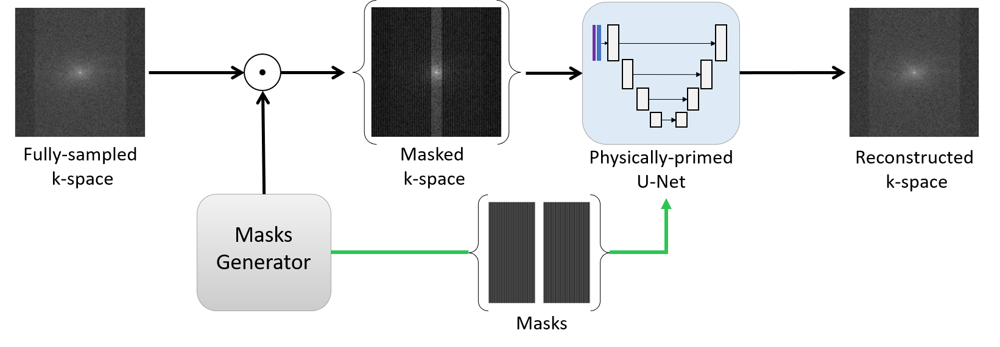

# MA-RECON: Mask-aware deep-neural-network for robust fast MRI k-space interpolation
**Background and Objective**: High-quality reconstruction of MRI images from under-sampled 'k-space' data, which is in the Fourier domain, is crucial for shortening MRI acquisition times and ensuring superior temporal resolution. Over recent years, a wealth of deep neural network (DNN) methods have emerged, aiming to tackle the complex, ill-posed inverse problem linked to this process. However, their instability against variations in the acquisition process and anatomical distribution exposes a deficiency in the generalization of relevant physical models within these DNN architectures. The goal of our work is to enhance the generalization capabilities of DNN methods for k-space interpolation by introducing 'MA-RECON', an innovative physically-informed DNN architecture and associated training method.   
**Methods:** Unlike preceding approaches, our 'MA-RECON' architecture encodes not only the observed data but also the under-sampling mask within the model structure. It implements a tailored training approach that leverages data generated with a variety of under-sampling masks to stimulate the model's generalization of the under-sampled MRI reconstruction problem. Therefore, effectively represents the associated inverse problem, akin to the classical compressed sensing approach.   
**Results:** The benefits of our MA-RECON approach were affirmed through rigorous testing with the widely accessible fastMRI dataset. Compared to standard DNN methods and DNNs trained with under-sampling mask augmentation, our approach demonstrated superior generalization capabilities. This resulted in a considerable improvement in robustness against variations in both the acquisition process and anatomical distribution, especially in regions with pathology.   
**Conclusion:** In conclusion, our mask-aware strategy holds promise for enhancing the generalization capacity and robustness of DNN-based methodologies for MRI reconstruction from undersampled k-space data.  

